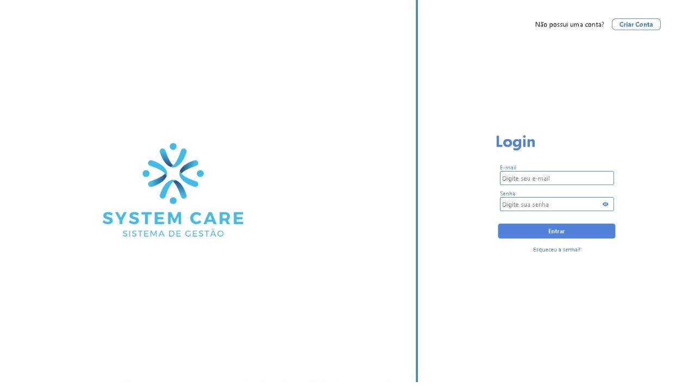
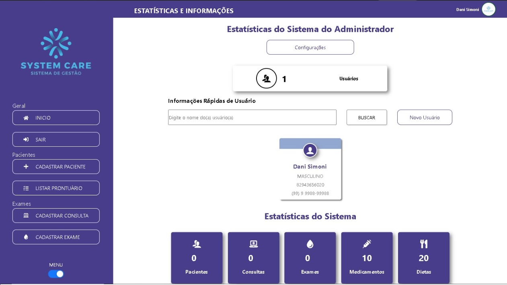

<div align="center">
<h1> MEDI TECH PRO</h1>
</div>

<div align="center">


[](https://react.dev/)
[](https://vitejs.dev/)
[](https://ant.design/)

[](https://opensource.org/licenses/MIT)

[](https://github.com/FullStack-Trindade/M3P-FrontEnd-Squad1/watchers)
[](https://github.com/FullStack-Trindade/M3P-FrontEnd-Squad1/watchers)
[](https://github.com/FullStack-Trindade/M3P-FrontEnd-Squad1/forks)

</div>
<br>

Este é um projeto Express para uma aplicação do sistema hospitalar MEDI TECH PRO, que gerencia o cadastro de pacientes, médicos, enfermeiros e o registro de consultas, exames, dietas, exercícios e medicamentos.

## 🎯 Contexto

A MEDI TECH, líder no setor de tecnologia para gestão hospitalar, recebeu um aporte financeiro para aprimorar seu principal produto, tornando-o disponível em postos de saúde e clínicas particulares em todo o país.

O objetivo desta aplicação é criação do frontend para:
- Registrar e gerenciar médicos, enfermeiros e pacientes.
- Registrar atendimentos médicos, incluindo consultas e exames.
- Registrar atendimentos de enfermeiros, incluindo dietas, exercícios e medicamentos.
- White-label para adequar-se a identidade visual de cada cliente.

Este projeto também possui um repositório [Backend](https://github.com/FullStack-Trindade/M3P-BackEnd-Squad1), criando um sistema completo.

A aplicação foi desenvolvida como projeto de conclusão do Módulo 3 do Curso de Capacitação Dev FullStack oferecido pelo Lab365 / Senai - SC.

## ⚙️ Funcionalidades

A interface WEB disponibilizada, compreende as funcionalidade relativa a:

- Login e autenticação.
- Estatísticas e cartões informativos
- Usuário: Leitura edição e cadastros via formulário.
- Pacientes: Leitura edição e cadastros via formulário.
- Consultas: Leitura edição e cadastros via formulário.
- Exames: Leitura edição e cadastros via formulário.
- Prontuários: Leitura edição e cadastros via formulário.
- Exercícios: Leitura edição e cadastros via formulário.
- Dietas: Leitura edição e cadastros via formulário.
- Medicamentos: Leitura edição e cadastros via formulário.
- Personalização do ambiente

Abaixo algumas imagens do sistema:




## 🛠️ Tecnologias Utilizadas

Principais tecnologias

- [Ecma Script/ Java Script](https://www.ecma-international.org)
- [React v18.x](https://react.dev/)
- [Vite](https://vitejs.dev/)

Bibliotecas de React.js:

### Dependências:

- [Ant Design](https://ant.design/): Biblioteca de componentes de interface de usuário para React.
- [node-fetch](https://www.npmjs.com/package/node-fetch): Uma implementação do navegador da API Fetch para Node.js.
- [prop-types](https://www.npmjs.com/package/prop-types): Pacote para documentar e validar tipos de propriedades em componentes React.
- [React](https://react.dev/): Biblioteca principal do React.
- [React DOM](https://react.dev/docs/react-dom): Biblioteca para manipulação do DOM em aplicações React.
- [React Hook Form](https://react-hook-form.com/): Biblioteca para gerenciamento e validação de formulários em React.
- [React Icons](https://www.npmjs.com/package/react-icons): Biblioteca com uma coleção de ícones para uso em aplicações React.
- [React Router DOM](https://reactrouter.com/en/main): Pacote para gerenciamento de rotas em aplicações React.
- [Styled Components](https://styled-components.com/): Biblioteca para estilização de componentes React com CSS-in-JS.
- [Yup](https://www.npmjs.com/package/yup): Biblioteca para criação de esquemas de validação em JavaScript.

### Dependências de Desenvolvimento:

- [@types/react](https://www.npmjs.com/package/@types/react): Tipos TypeScript para o React.
- [@types/react-dom](https://www.npmjs.com/package/@types/react-dom): Tipos TypeScript para o React DOM.
- [@vitejs/plugin-react](https://www.npmjs.com/package/@vitejs/plugin-react): Plugin Vite para suporte ao React.
- [Concurrently](https://www.npmjs.com/package/concurrently): Ferramenta para executar comandos em paralelo.
- [ESLint](https://eslint.org/): Linter de código JavaScript.
- [ESLint Plugin React](https://www.npmjs.com/package/eslint-plugin-react): Plugin do ESLint para regras relacionadas ao React.
- [ESLint Plugin React Hooks](https://www.npmjs.com/package/eslint-plugin-react-hooks): Plugin do ESLint para regras de hooks do React.
- [ESLint Plugin React Refresh](https://www.npmjs.com/package/eslint-plugin-react-refresh): Plugin do ESLint para suporte ao React Refresh.
- [Vite](https://vitejs.dev/): Servidor de desenvolvimento Vite.

**Variáveis de Ambiente:**

Para executar o projeto, renomeie o arquivo `.env.local.example` para `.env.local` e configure as variáveis conforme necessário.

## 💻 Rodando localmente

<p align="justify">
É interessante que tenha <a href="https://git-scm.com/">Git</a> ou outro <i>software</i> de controle de versionamento instalado em seu equipamento, assim como um editor de código como o <a href="https://code.visualstudio.com/">VSCode</a>.
<br><br>
Antes de iniciar a aplicação, execute a parte do projeto correspondente ao <a href='https://github.com/FullStack-Trindade/M3P-BackEnd-Squad1'><i>back-end</i></a>. Esse é um passo importante para o bom funcionamento da aplicação.
</p>
<br>

Siga os passos abaixo para iniciar o projeto em modo de desenvolvimento:

Clone o projeto

```bash
  git clone https://github.com/FullStack-Trindade/M3P-FrontEnd-Squad1.git
```

Entre no diretório do projeto

```bash
  cd my-project
```

Instale as dependências

```bash
  npm i
```

Inicie o servidor

```bash
  npm run dev
```
As mensagens seguintes devem aparecer após ``npm run dev`` :

```
    VITE v4.4.3

    Local:   http://localhost:5173/
```
## 🌲 Estrutura

```
├───public
│   └───images
└───src
    ├───Assets
    ├───Components
    │   ├───AreaEstatísticas
    │   ├───CardConsulta
    │   ├───CardDieta
    │   ├───CardEstatistica
    │   ├───CardEstatisticaADM
    │   ├───CardExame
    │   ├───CardExercicio
    │   ├───CardMedicalRecord
    │   ├───CardMedicamento
    │   ├───CardPaciente
    │   ├───CardUser
    │   ├───ForgotModal
    │   ├───Form
    │   │   ├───InputComponent
    │   │   └───SelectComponent
    │   ├───FormAppointment
    │   ├───FormDiet
    │   ├───FormExam
    │   ├───FormMedication
    │   ├───FormPaciente
    │   │   └───InputComponent
    │   ├───FormUsuario
    │   │   └───InputComponent
    │   ├───FromExercise
    │   ├───InputPatientSearchAtHome
    │   ├───InputSearch
    │   ├───InputSearchAppointment
    │   ├───InputSearchDiet
    │   ├───InputSearchExam
    │   ├───InputSearchExercise
    │   ├───InputSearchMedicalRecord
    │   ├───InputSearchMedication
    │   ├───InputSearchPaciente
    │   ├───InputSearchProntuario
    │   ├───InputSearchUser
    │   ├───InputUserSearchAtHome
    │   ├───LoginForm
    │   ├───Menu
    │   │   ├───MenuComponent
    │   │   ├───MenuItem
    │   │   └───MenuItemFechado
    │   ├───ResetPasswordForm
    │   ├───SelectComponent
    │   ├───ToolBar
    │   └───UserAddBtn
    ├───Context
    ├───Layout
    ├───Pages
    │   ├───AppointmentRegister
    │   ├───CadastroExame
    │   ├───CadastroExercise
    │   ├───CadastroPaciente
    │   ├───CadastroUsuario
    │   ├───ConfigPage
    │   ├───DietRegister
    │   ├───HomePage
    │   ├───ListaProntuarioPage
    │   ├───LoginPage
    │   ├───MedicalRecords
    │   ├───MedicationPage
    │   ├───Password
    │   └───ProntuarioPacientePage
    ├───Server
    └───Service
```

# ✏️ Aprendizados da Equipe

- Criação de Aplicação utilizando RactJs/ Vite;
- Validação de formulários e integração a endpoints (backend);
- Lidar com reras de negócios complexas;
- Trabalho em equipe e gitflow;

## 🚀 Melhorias Futuras

1- Página para recuperação de senha.

2- Página "Erro 404- Página não encontrada" personalizada.

3- Página de listagem de atendimentos por Médico/ Enfermeiro

4- Pronutário Online

## ✍🏻 Autores

Feito por 🔥Furious Five🔥 (Squad 1), composto por [Beatriz Christie](https://github.com/biachristie),  [Daniel Simoni](https://github.com/DaniSimoni), [Gabriel Pacheco](https://github.com/gabrieldelpacheco), [Reinaldo Porto](https://github.com/portexrp) e [Rodrigo Pieritz](https://github.com/rodrigopieritz) (P.O)🖐🏻

## 🛠️ Feedback e Suporte

Se você tiver algum feedback ou algo não estiver funcionando, por favor nos deixe saber por meio de rodrigo_o_pieritz@estudante.sesisenai.org.br

## 📌 Licença

Este código está sob a Licença MIT, cujo texto pode ser lido em [MIT License](https://github.com/FullStack-Trindade/M3P-BackEnd-Squad1/blob/main/LICENSE.md).
